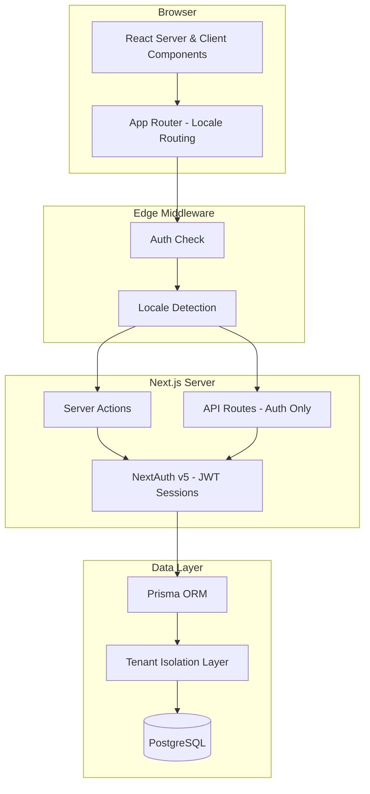
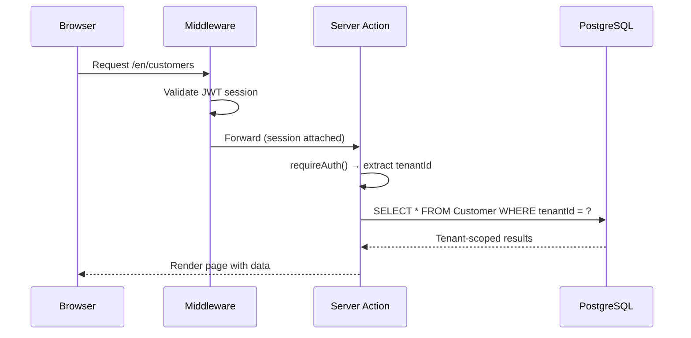
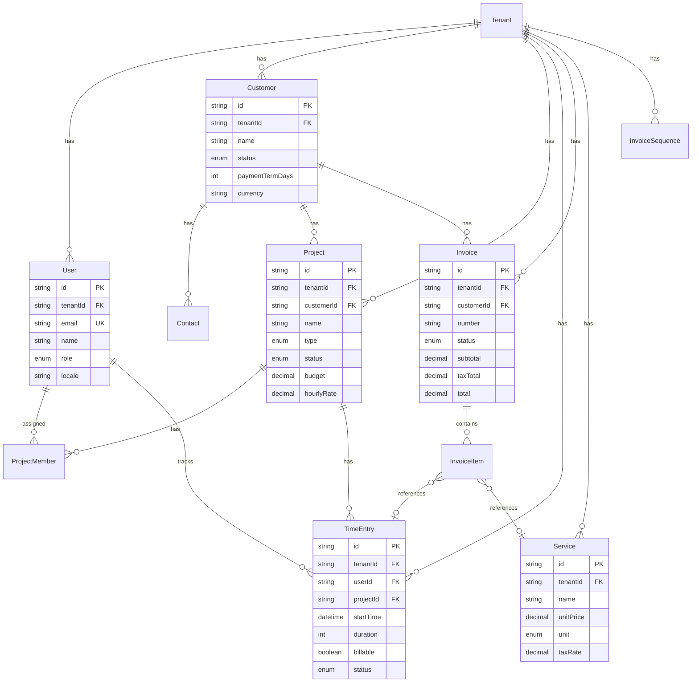
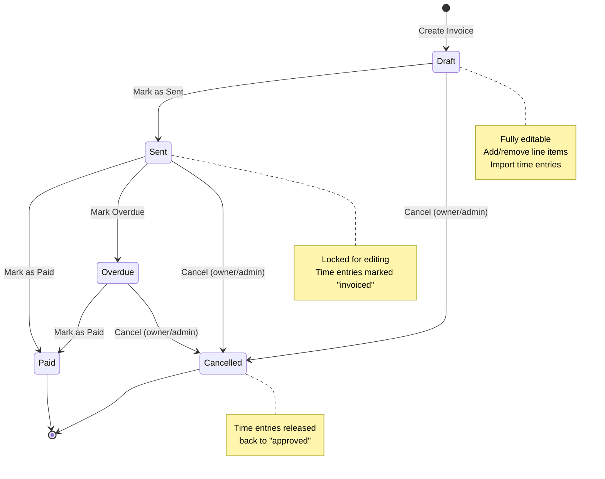
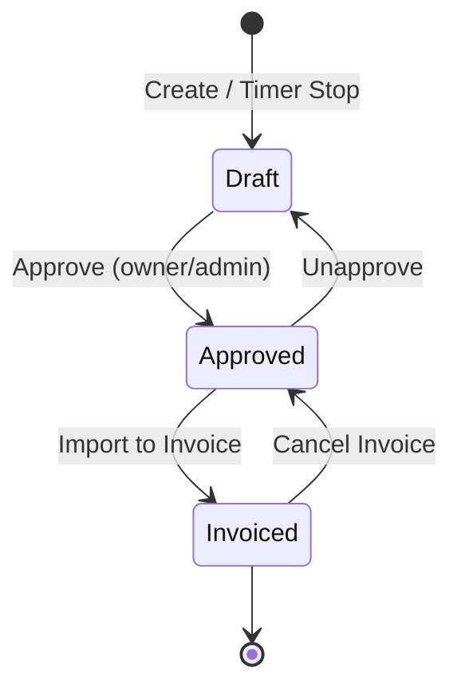
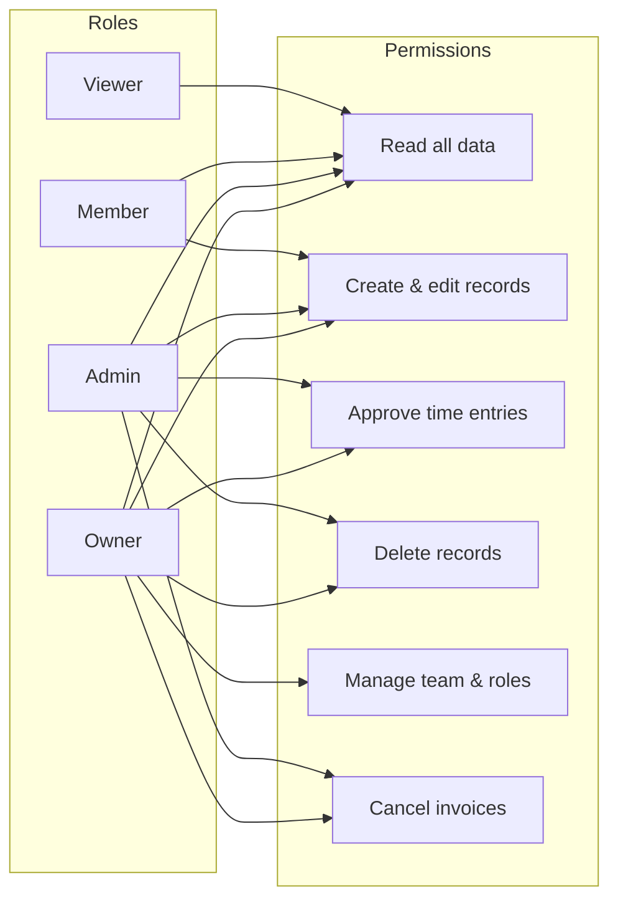
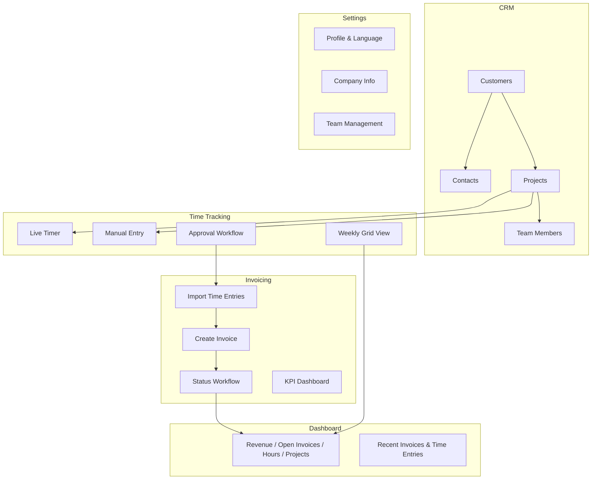

# miniAMS

A multi-tenant agency management SaaS for small software agencies. CRM, project management, time tracking, and invoicing — all in one clean, mobile-first application.

**Live:** [Vercel Deployment](https://vercel.com/oliver-baers-projects/mini-ams)

---

## Features

- **Multi-Tenant Architecture** — Complete data isolation per company
- **CRM** — Customers, contacts, status tracking, tags
- **Projects** — Team management, budgets, hourly rates, customer linking
- **Time Tracking** — Start/stop timer, manual entries, weekly grid view, approval workflow
- **Invoicing** — Atomic invoice numbering (RE-YYYY-NNNN), time entry import, status workflow, KPI dashboard
- **Settings** — Profile, company info, team management with role-based access
- **i18n** — German and English from day one
- **Mobile First** — Bottom navigation, card layouts, touch-optimized

---

## Architecture Overview



---

## Multi-Tenant Data Flow

Every request is scoped to a tenant. The JWT session carries the `tenantId`, and every database query includes it as a mandatory filter.



---

## Entity Relationship Diagram



---

## Invoice Lifecycle



---

## Time Entry Workflow



---

## Role-Based Access Control



---

## Tech Stack

| Layer        | Technology                              |
|-------------|------------------------------------------|
| Framework   | Next.js 16 (App Router, Turbopack)       |
| Language    | TypeScript 5                             |
| UI          | shadcn/ui + Tailwind CSS v4              |
| Auth        | NextAuth v5 (Credentials, JWT sessions)  |
| Database    | PostgreSQL + Prisma 6                    |
| i18n        | next-intl v4 (DE + EN)                   |
| Validation  | Zod v4                                   |
| Icons       | Lucide React                             |
| Deploy      | Vercel + managed PostgreSQL              |

---

## Project Structure

```
miniAMS/
├── prisma/
│   ├── schema.prisma          # 13 models, multi-tenant
│   └── seed.ts                # Demo data
├── messages/
│   ├── de.json                # German translations
│   └── en.json                # English translations
├── src/
│   ├── app/
│   │   ├── [locale]/
│   │   │   ├── (auth)/        # Login, Register
│   │   │   ├── (dashboard)/   # Protected app shell
│   │   │   │   ├── page.tsx           # Dashboard
│   │   │   │   ├── customers/         # CRM
│   │   │   │   ├── projects/          # Projects
│   │   │   │   ├── time/              # Time Tracking
│   │   │   │   ├── invoices/          # Invoicing
│   │   │   │   └── settings/          # Settings
│   │   │   └── layout.tsx
│   │   └── api/auth/          # NextAuth routes
│   ├── components/
│   │   ├── ui/                # 20+ shadcn primitives
│   │   ├── layout/            # Sidebar, TopBar, MobileNav
│   │   ├── shared/            # StatusBadge, EmptyState, etc.
│   │   ├── customers/         # Customer components
│   │   ├── projects/          # Project components
│   │   ├── time/              # Time tracking components
│   │   ├── invoices/          # Invoice components
│   │   └── settings/          # Settings components
│   ├── lib/
│   │   ├── actions/           # 8 server action files
│   │   ├── validations/       # 6 Zod schema files
│   │   ├── auth.ts            # NextAuth config
│   │   ├── db.ts              # Prisma singleton
│   │   ├── tenant.ts          # Tenant context helpers
│   │   └── format.ts          # Date/currency formatters
│   ├── i18n/                  # next-intl config
│   └── types/                 # TypeScript declarations
└── vercel.json                # Deployment config
```

---

## Security

miniAMS implements defense-in-depth for multi-tenant isolation:

- **Tenant scoping** — Every database query includes `tenantId` in the WHERE clause
- **Defense-in-depth** — All UPDATE/DELETE operations include `tenantId` even after pre-checks
- **Cross-tenant validation** — Foreign key references (customerId, serviceId, timeEntryId) validated against tenant
- **Role-based access** — Viewer role blocked from all write operations; delete/cancel restricted to owner/admin
- **Input validation** — All inputs validated via Zod schemas with max-length/max-size constraints
- **Auth guards** — `requireAuth()` verifies both session AND tenantId presence
- **JWT sessions** — Stateless, includes userId, tenantId, role, locale
- **Password hashing** — bcrypt with 12 rounds
- **Global email uniqueness** — Prevents cross-tenant login ambiguity

---

## Module Overview



---

## Getting Started

See **[QUICKSTART.md](./QUICKSTART.md)** for setup instructions.

### Demo Credentials

| Field    | Value              |
|----------|--------------------|
| Email    | `demo@miniams.dev` |
| Password | `password123`      |

---

## Development

```bash
# Start dev server
npm run dev

# Open database GUI
npm run db:studio

# Reset and reseed database
npm run db:push -- --force-reset && npm run db:seed
```

---

## Deployment

miniAMS is optimized for Vercel with managed PostgreSQL.

### Required Environment Variables

| Variable         | Description                    |
|-----------------|--------------------------------|
| `DATABASE_URL`  | PostgreSQL connection string   |
| `NEXTAUTH_SECRET` | JWT signing secret (32+ chars) |

### Deploy to Vercel

1. Connect your GitHub repository to Vercel
2. Set environment variables in Project Settings
3. Vercel auto-deploys on push to `main`

The `vercel.json` config handles Prisma generation and optimizes for the `fra1` (Frankfurt) region.

---

## License

Private. All rights reserved.
